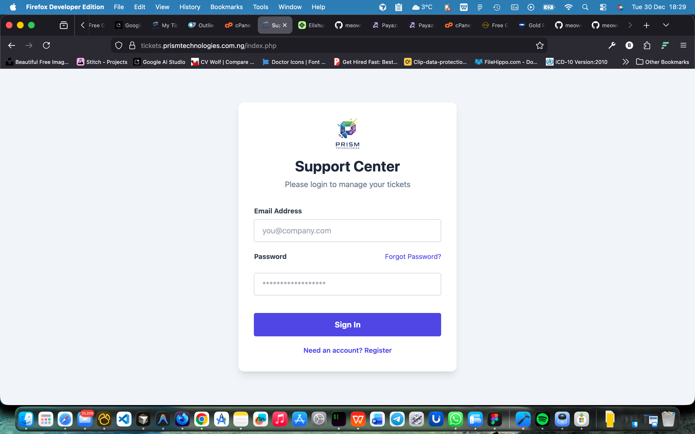
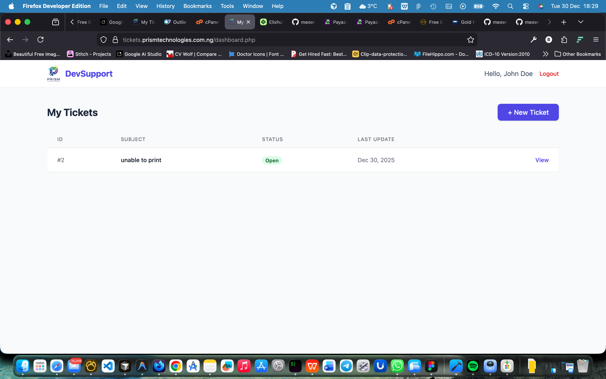
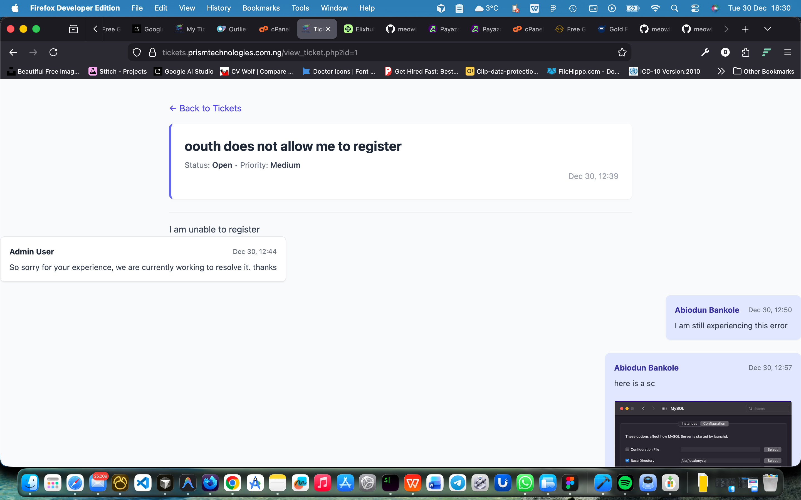

# Prism Ticket: A Simple & Clean Customer Support System

Prism Ticket is a lightweight, user-friendly, and visually clean online ticketing system designed for software development companies to manage customer issues effectively. Built with PHP and styled with Tailwind CSS, it prioritizes a frictionless user experience to ensure clients can report and track issues without frustration.

_(Image shows a composite of the Login, Dashboard, and Ticket View screens)_

<p align="center">
  
  
  
</p>

## ✨ Key Features

- **Secure User Authentication:** A clean login screen for clients to access their support dashboard.
- **Intuitive Dashboard:** View all submitted tickets at a glance.
- **Color-Coded Statuses:** Instantly identify ticket status (`Open`, `In Progress`, `Resolved`) with clear visual cues.
- **Effortless Ticket Creation:** A straightforward form allows users to create new support tickets with a title, detailed description, and priority level.
- **Conversational Ticket View:** Track the progress of an issue through a chat-style interface that is easy to follow.
- **Seamless Updates:** Users can add replies and updates to their tickets until they are resolved.
- **Minimalist & Responsive UI:** Built with Tailwind CSS, the interface is clean, modern, and works well on different screen sizes.

## 🚀 Tech Stack

- **Backend:** PHP
- **Database:** MySQL / MariaDB
- **Frontend:**
  - HTML
  - [Tailwind CSS](https://tailwindcss.com/) (via CDN for simplicity)
  - JavaScript (for future enhancements)

## 🔧 Installation & Setup Guide

Follow these steps to get Prism Ticket running on your local machine.

### Prerequisites

You need a local web server environment with PHP and MySQL.

- [XAMPP](https://www.apachefriends.org/index.html) (Windows, macOS, Linux)
- [WAMP](https://www.wampserver.com/en/) (Windows)
- [MAMP](https://www.mamp.info/en/mamp/) (macOS)

### 1. Clone the Repository

Open your terminal or command prompt and run:

```bash
git clone https://github.com/meowbanky/prism_ticket.git
cd prism_ticket
```

### 2. Set Up the Database

You need to create a database and import the table structure.

1.  **Start** your Apache and MySQL services from your server control panel (e.g., XAMPP Control Panel).
2.  Open **phpMyAdmin** by navigating to `http://localhost/phpmyadmin`.
3.  Create a new database. Let's call it `ticket_system`.
4.  Click on the newly created database and go to the **"SQL"** tab.
5.  Copy the entire content of the `database.sql` file from this repository and paste it into the SQL query box.
6.  Click **"Go"** to execute the query. This will create the `users`, `tickets`, and `updates` tables, and insert a sample user.

**Sample User Credentials:**

- **Email:** Use the email you registered with.
- **Password:** Use the password you created.

### 3. Configure the Connection

The final step is to tell the application how to connect to your new database.

1.  Open the `db.php` file in your code editor.
2.  Update the database credentials to match your local setup. (For a default XAMPP installation, you might only need to change the database name).

```php
// In db.php

$host = 'localhost';
$db   = 'ticket_system'; // The name of the database you created
$user = 'root'; // Your MySQL username (usually 'root')
$pass = '';     // Your MySQL password (usually empty by default)
```

### 4. Run the Application

1.  If you haven't already, move the entire `prism_ticket` folder into your web server's root directory.
    - For XAMPP, this is usually `C:/xampp/htdocs/`.
    - For MAMP, it's `Applications/MAMP/htdocs/`.
2.  Open your web browser and navigate to:
    ```
    http://localhost/prism_ticket
    ```

You should now see the login screen. You can log in with the sample user credentials to start using the system.

## 💡 UI/UX Design Philosophy

This project was designed with three core principles in mind:

1.  **Clarity:** Users are often stressed when reporting a bug. The interface uses ample whitespace, clear typography, and a logical flow to reduce cognitive load.
2.  **Trust:** The professional and clean design, combined with consistent feedback (hover effects, clear buttons), builds user confidence in the system.
3.  **Efficiency:** The entire process, from logging in to creating a ticket and adding an update, is designed to be as fast and intuitive as possible. The conversational view for tickets makes following progress natural and easy.

## LICENSE

This project is licensed under the MIT License. See the [LICENSE](LICENSE) file for details.
